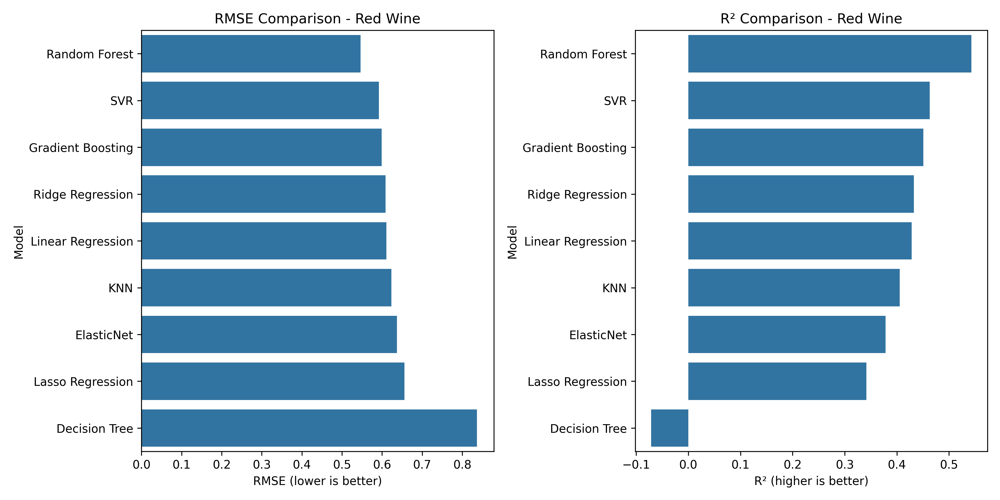
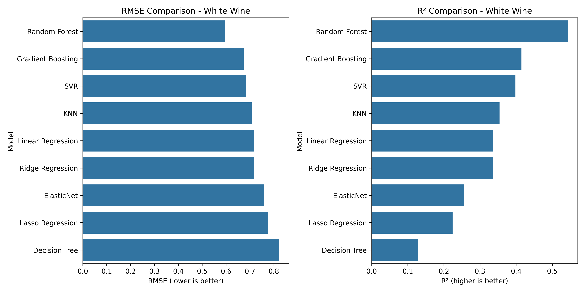
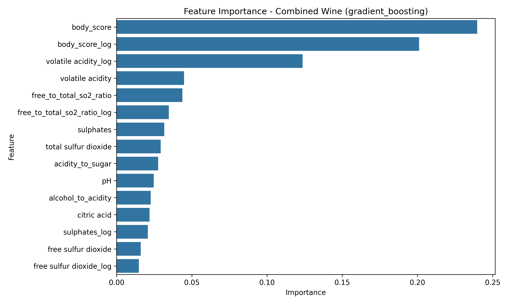

# Wine Quality Prediction

A comprehensive machine learning project that predicts wine quality based on physicochemical properties, demonstrating end-to-end ML workflow from data analysis to interactive visualization.

[](https://www.python.org/downloads/)
[](https://scikit-learn.org/)
[](https://streamlit.io/)

## 🍷 Project Overview

This project builds machine learning models to predict wine quality scores based on physicochemical properties of Portuguese "Vinho Verde" wines. It showcases a complete data science workflow including:

- **Data exploration and visualization**
- **Advanced feature engineering**
- **Multiple modeling approaches (regression and classification)**
- **Model interpretation with domain-specific insights**
- **Interactive web application for predictions**

### Key Features

- **Comprehensive Data Analysis**: Deep exploration of wine chemical properties and their relationship to quality ratings
- **Advanced Feature Engineering**: Creation of domain-specific derived features that significantly improve model performance
- **Multiple Modeling Approaches**:
  - Regression models predicting exact quality scores (1-10)
  - Binary classification models categorizing wines as good or bad
  - Multi-class classification models sorting wines into bad, average, or good categories
- **Model Optimization**: Hyperparameter tuning to maximize prediction accuracy
- **In-depth Model Interpretation**: SHAP analysis, partial dependence plots, and threshold identification
- **Domain-Specific Insights**: Translation of model findings into practical recommendations for winemakers
- **Interactive Web Application**: User-friendly Streamlit interface for real-time predictions

## 📊 Results & Insights

The project achieved impressive prediction results:

- **Red Wine**:
  - Best regression model: Random Forest (RMSE: ~0.56)
  - Best classification accuracy: Gradient Boosting (~90%)
  - Key drivers: Alcohol content, volatile acidity, sulphates

*Comparison of different model performances for red wine quality prediction*

- **White Wine**:
  - Best regression model: Random Forest (RMSE: ~0.51)
  - Best classification accuracy: Random Forest (~91%)
  - Key drivers: Alcohol content, density, residual sugar

*Comparison of different model performances for white wine quality prediction*

### Key Discoveries

- **Alcohol content** consistently emerged as the strongest predictor of wine quality across all models

*Feature importance analysis showing body score and volatile acidity as top predictors of wine quality*
- **Critical thresholds** were identified where quality dramatically improves:
  - Red wine: Alcohol > 12%, Volatile acidity < 0.7 g/L
  - White wine: Alcohol > 11.5%, Residual sugar balanced with acidity
- **Different chemical profiles** significantly impact red vs. white wine quality ratings
- **Feature interactions** revealed important balance factors between acidity, alcohol, and sugar

## 🧪 Data Sources

The analysis used two datasets of Portuguese "Vinho Verde" wines:
- Red wine: 1,599 samples
- White wine: 4,898 samples
- Each with 11 physicochemical input features and quality ratings (0-10)

*Reference: P. Cortez, et al. "Modeling wine preferences by data mining from physicochemical properties." Decision Support Systems, 47(4):547-553, 2009.*

## 🏗️ Project Structure
```
wine_quality_prediction/
│
├── data/                       # Data directory
│   ├── raw/                    # Original wine datasets
│   └── processed/              # Processed datasets
│       └── engineered/         # Feature-engineered datasets
│
├── models/                     # Trained ML models
│
├── reports/                    # Analysis outputs
│   ├── figures/                # Visualizations
│   └── interpretation/         # Model interpretation reports
│
├── src/                        # Source code
│   ├── data/                   # Data loading scripts
│   ├── features/               # Feature engineering
│   ├── models/                 # Model training & prediction
│   └── visualization/          # Data visualization
│
├── app.py                      # Streamlit web application
├── requirements.txt            # Dependencies
└── README.md                   # Project documentation
```

## 🚀 Getting Started

### Installation

1. Clone this repository:
```bash
git clone https://github.com/vatsalmehta2001/wine_quality_prediction
cd wine_quality_prediction
```

2. Install required packages:
```bash
pip install -r requirements.txt
```

### Running the Pipeline

1. **Data Exploration**:
```bash
python src/data/load_data.py
python src/visualization/explore_visualize.py
```

2. **Feature Engineering**:
```bash
python src/features/feature_engineering.py
```

3. **Model Training**:
```bash
python src/models/train_models.py
```

4. **Model Interpretation**:
```bash
python src/models/model_interpretation.py
```

### Making Predictions

Use trained models to predict quality for new wine samples:
```bash
python src/models/predict.py --wine-type red --task regression --input-file new_samples.csv
```

## 🌟 Interactive Web Application

The project includes a Streamlit web application that allows users to:
- Input custom wine chemical properties
- Select different prediction models
- View real-time quality predictions
- Explore how specific features affect wine quality
- Visualize feature importance and threshold effects

To run the application:
```bash
streamlit run app.py
```
If you encounter any issues with the default configuration, you can use:
```bash
streamlit run app.py --server.port=8501 --server.headless=false
```


## 🛠️ Technologies Used

- **Python** for all data processing and modeling
- **Pandas & NumPy** for data manipulation
- **Scikit-learn** for machine learning algorithms
- **Matplotlib & Seaborn** for visualization
- **SHAP** for model interpretation
- **Streamlit** for the interactive web application

## 🔮 Future Work

- Implement deep learning models for potentially higher accuracy
- Expand to additional wine varieties beyond Vinho Verde
- Create a deployed web service for public use
- Incorporate wine image analysis for additional features
- Add automatic recommendation engine for improving wine quality

## 📝 License

This project is licensed under the MIT License - see the LICENSE file for details.

## 👤 Developer

Vatsal Gagankumar Mehta

*Developed as a showcase of end-to-end machine learning capabilities for data science portfolio*